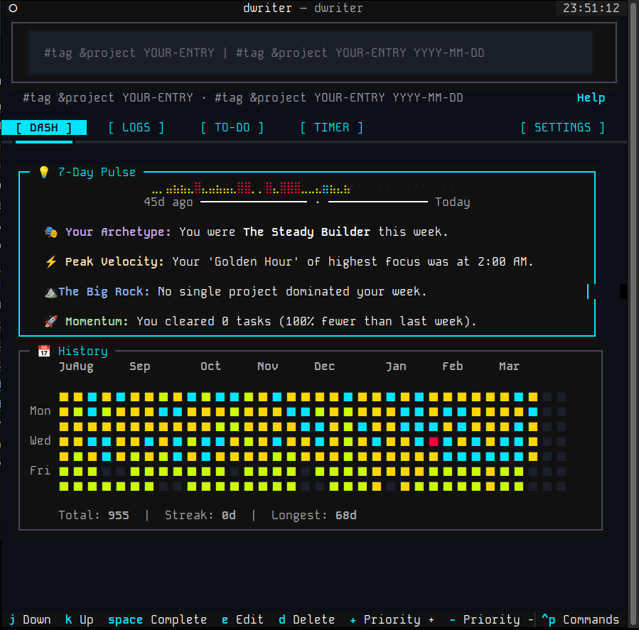
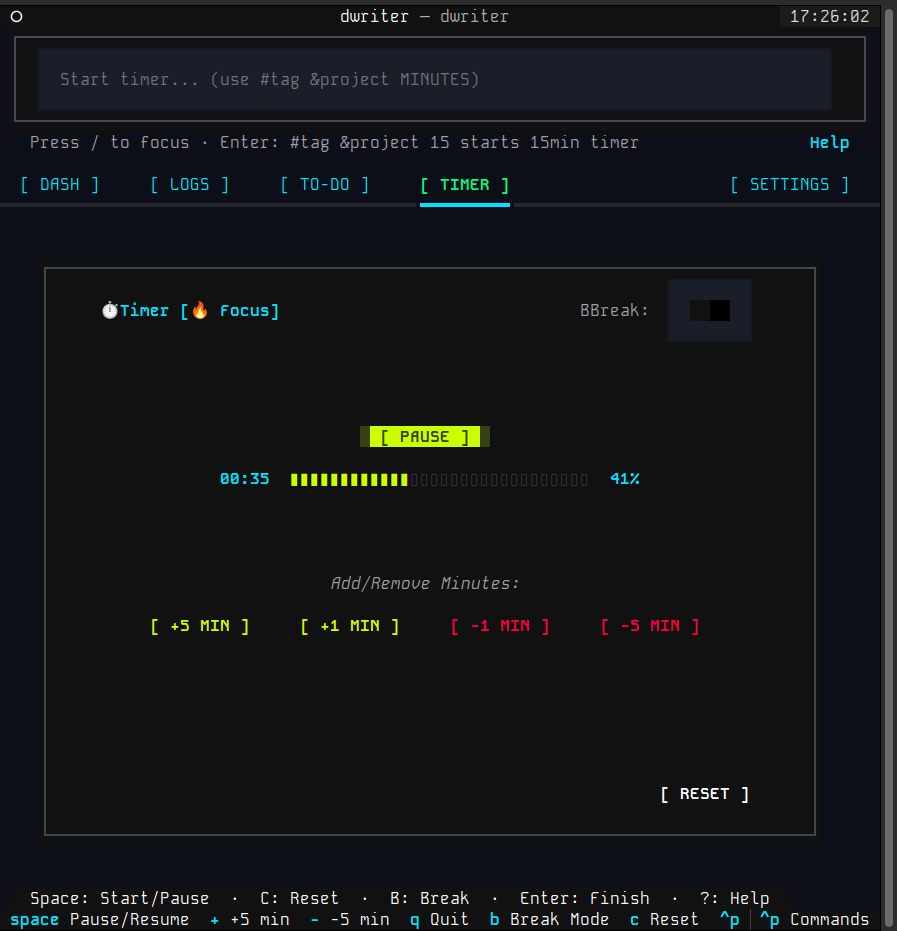
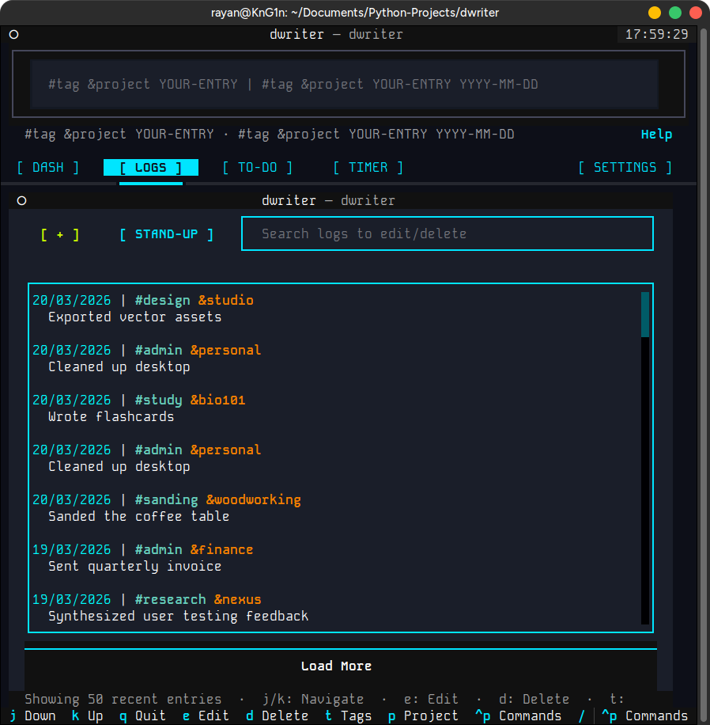

# dwriter 📝
### *The minimalist journal for those who live in the terminal.*

**dwriter** is a high-signal, low-friction journaling tool designed to capture your work without breaking your flow. It bridges the gap between the raw speed of a command-line interface and the visual clarity of a modern dashboard.

Whether you are a software engineer tracking "deep work," a freelancer logging billable hours, or a student managing assignments, **dwriter** stays out of your way until you need it.

---

## ✨ Core Philosophy: Speed & Clarity

Modern productivity apps are often cluttered with distractions. **dwriter** is designed to prioritize your focus:

*   **⚡ Immediate Capture:** Use the "Headless CLI" to log thoughts, tasks, or focus sessions in seconds without leaving your terminal environment.
*   **🎨 Unified Dashboard:** Launch the Terminal User Interface (TUI) to reflect, search your history, or manage a visual todo board.
*   **🤖 Standup Automation:** Instantly transform your raw logs into formatted summaries for Slack, Jira, or Markdown.
*   **📅 Natural Language:** Talk to your journal like a human. `dwriter add "Fixed the bug" --date "last Friday"` just works.

---

## 🚀 Quick Start

Getting started is as simple as a single command. We use **uv**, the fastest Python package manager, to keep your installation clean and isolated.

### 1. Install the tool (uv)
Choose your operating system and paste the command into your terminal:

*   **Linux / macOS:**
    ```bash
    curl -LsSf https://astral.sh/uv/install.sh | sh
    ```
*   **Windows (PowerShell):**
    ```powershell
    powershell -c "irm https://astral.sh/uv/install.ps1 | iex"
    ```

### 2. Clone and Install dwriter
Clone the repository, navigate to the `dwriter` directory, by running:
```bash
git clone https://github.com/rhaeyyan/dwriter.git
```
> make sure to remember where you cloned the repository!
```bash
cd dwriter
```
> Or navigate to where you cloned the repository (in terminal).
```bash
uv tool install .
```

### 3. Keep dwriter Current
To pull the newest features and architectural improvements (see **[Update Notes](documentation/update-notes.md)**), navigate to your local `dwriter` directory and run:
```bash
git pull origin main
uv tool install --upgrade .
```

---

## 🎮 How to Use dwriter

### 📊 The Visual Dashboard (TUI)
To **launch** the interface:

```bash
dwriter
```


*The dwriter Unified Dashboard: High-contrast analytics meets chronological logging.*

Inside the dashboard, you can:
- **✅ Add/Manage To-do's:** Keyboard-driven task board with priorities.
- **⏱️ Focus Timer:** A full-screen countdown that auto-logs your progress.
- **🔍 Search/Edit/Review:** Live-filtering fuzzy search across all your history.
- **📈 Activity Map:** Visualize your productivity streaks and habits and generate reports.


*Immersive Focus: The full-screen TUI timer designed for zero-distraction deep work.*


*Interactive History: Fuzzy-filtering through thousands of entries in real-time.*

**dwriter** operates in two modes: the **Fast Command-Line** (for speed) and the **Visual Dashboard** (for depth).

### ✍️ The Fast Command-Line (Headless)
Capture your work the moment it happens. No switching windows, no distractions.

```bash
# Log a quick entry (Always use "quotes" for #tags or &projects)
dwriter add "Refactored the auth layer #backend &project-x"

# Start a 25-minute focus session with shorthand notation
dwriter timer "25 &feature-y #deepwork"

# Add a task to your todo list
dwriter todo "Review the pull request" --priority urgent
```
---

## 💡 Mastering the Workflow

**dwriter** is designed to be your frictionless "brain-to-terminal" bridge. It adapts to your mental state, allowing you to capture everything from high-level project goals to fleeting creative sparks without breaking your momentum.

### 🏃 Frictionless Capture (The "Keys-Down" Loop)
*Jot down a note, thought, idea, reminder, or instruction in seconds.*
- **Instant Entry:** `dwriter add "Idea: build a moisture sensor for the garden #someday"`
- **Quick Planning:** `dwriter todo "Review the pull request &internal-tools !urgent @due:tomorrow"`
- **Priority & Deadlines:** Use `!priority` (`!urgent`, `!high`, `!low`) and `@due:date` (`@due:friday`, `@due:2024-01-15`) directly in your text.
- **Zero Double-Entry:** Use `dwriter done <id>` to complete a task; it's automatically moved to your journal with a timestamp.
- **Instant Signal:** Run `dwriter stats` for a beautiful text-based productivity report without leaving your prompt.

### 🎨 Creative Organization & Retrieval
*You are the architect of your own history. There are no rigid categories—only your own imagination.*
- **Total Freedom:** Use `#tags` and `&projects` however you like. Be as specific or as broad as your workflow demands (e.g., `#draft`, `&home:renovation`, `#aha-moment`).
- **Fuzzy Search:** Don't worry about perfect spelling or exact matches. Use `/` in the TUI or `dwriter search "query"` to find that one obscure note from three months ago.
- **Hierarchical Depth:** Use colons to organize complex structures like `&client:acme:q4-report`.

### 🧘 Deep Reflection (The Visual Dashboard)
*Switch to the TUI when you need perspective or a birds-eye view.*
- **The Dashboard:** Run `dwriter` (or `dwriter ui`) to manage your todo board and activity map side-by-side.
- **Visual History:** Revisit your trip through a chronological log that feels like a film strip of your memories.
- **Easy Correction:** Use the interactive `dwriter edit` to quickly fix typos or add detail to past entries.

> [!TIP]
> **Shell Safety:** Always wrap commands containing `&` or `#` in quotes (e.g., `dwriter timer "25 &work #focus"`). This prevents your shell from misinterpreting symbols as background processes or comments.

---

## 📖 Explore Further

| Document | Description |
| :--- | :--- |
| 🚀 **[Update Notes](documentation/update-notes.md)** | **New in v3.7.0:** 7-Day Weekly Pulse, enhanced analytics, and --weekly CLI flags. |
| 🛠️ **[Command Reference](documentation/HEADLESS-README.md)** | A complete guide to every CLI command and flag. |
| 📖 **[Creative Use Cases](documentation/USE_CASES.md)** | 20 ways to use dwriter for brewing, fitness, travel, and more. |
| ⚙️ **[Dev & Config Guide](documentation/DEV-and-CONFIG.md)** | Customizing your themes, default projects, and dev setup. |

---

## ❓ Troubleshooting & Tips

*   **Shell Characters:** Always wrap your entries in `"quotes"` if they contain `#tags` or `&projects` to prevent your shell from misinterpreting them.
*   **Clipboard:** On Linux, install `xclip` or `xsel` to enable the "copy-to-clipboard" feature for standup summaries.
*   **Customization:** Run `dwriter config edit` to tweak your default project or change your standup format to `slack` or `jira`.

---
